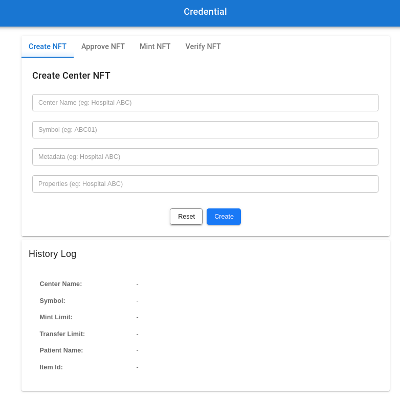

# 

## Credential and Certificate issuance

## The Problem We Want to Tackle

Verifying a person's COVID-19 test result can be challenging, especially when it comes to physical test results where the authenticity of a piece of paper can be questioned. Complications still arise when it comes to electronic records. Even if the electronic test result is not altered, how can we confirm that the data is correct and belongs to the right person? Lack of transparency in the entire testing process may further complicate matters. For instance, if a person has received a false negative result due to a lab technician's negligence, where do we look to identify the person responsible for this for corrective action? Has anybody ever wondered if blockchain technology, precisely non fungible tokens (NFTs), could become an ingenious solution to these concerns?

## Summary of Problem Statement

- Especially during pandemic, it's very hard to ensure the genuineness of everyone's credentials. Credentials verification is lack of transparency not tamper-proof.
- Apart from test results (which could be easily compromised), governments have no way of verifying if a patient has had COVID-19 and is virus-free. What solution can provide tamper-proof while retrievable data only with the right credentials by leveraging Maxonrow's NFT? 
- Help us build a solution that can help governments quickly retrieve verifiable data.

## Example Solution

- A methodology or solution to store huge amount of incorruptible records of credentials
- A methodology or solution to transform digital identity into decentralized identity
- A methodology or solution to capture, record & verify special credentials accurately

## Start Up Credential Project

### Step 1 - Start up blockchain localnet

- Start localnet [here](https://github.com/maxonrow/maxathon/tree/master/blockchain-starter-kit)

### Step 2 - Clone project

- Clone project `$ git clone https://github.com/maxonrow/challenge-credential.git`

### Step 3 - Navigate to backend

- Go to directory `cd challenge-credential/backend/services/credential-api`

### Step 4 - Build & run backend

- run `npm i` & subsequently with `npm run dev` & you should see `Service is serving http://localhost:8081`

### Step 5 - Navigate to frontend

- Go to directory `cd challenge-credential/frontend`

### Step 6 - Build & run frontend

- run `npm i` & subsequently with `npm run serve` & you should see `App running at: Local: http://localhost:8082`

### Step 7 - Checkout article

- checkout our [cookbook](https://medium.com/) on how to design & implement NFT.
- please! remember to claps, follow & share. we will mint you something! You will find out soon!

### Step 8 - Expected output

- 
